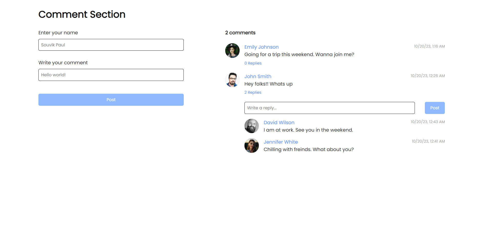

# Comment Section
In this project, I have created a comment section with the following features - 
- Write a comment
- Edit a comment
- Delete a comment
- Write reply to a comment
- Edit the reply
- Delete the reply
- View/Hide replies

## Installation

- Pull this branch into your local system.
- Make sure you have Node installed (preferrably Node v18.17.1).
- Navigate to the project directory and run 
  ```
  npm install
  ```
- Once all the dependencies have been installed, run the following command to start the project in development mode.
  ```
  npm run start
  ```

## Application previews



