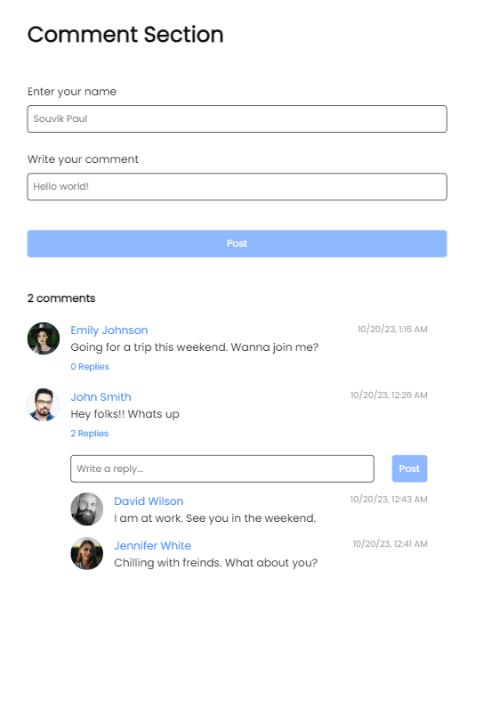

# Comment Section

## Installation

- Pull this branch into your local system.
- Make sure you have Node installed (preferrably Node v18.17.1).
- Navigate to the project directory and run 
  ```
  npm install
  ```
- Once all the dependencies have been installed, run the following command to start the project in development mode.
  ```
  npm run start
  ```

## Application previews



